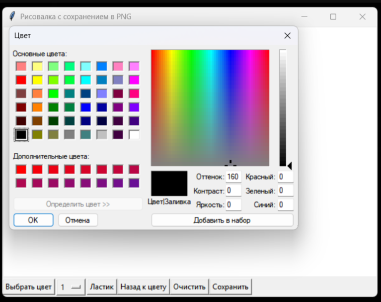
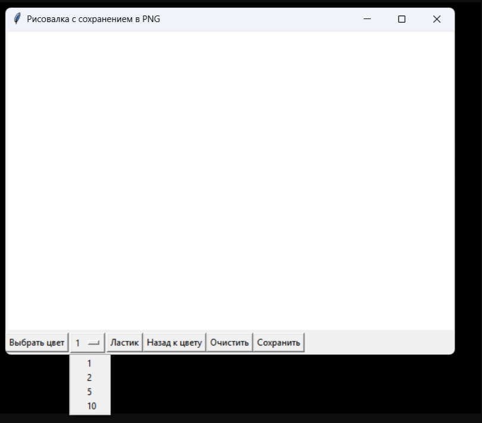

# Программа для создания изображений на основе TKinter

Данная программа представляет собой пример использования библиотеки TKinter для создания графического интерфейса.

## Класс DrawingApp

### Инициализация `__init__(self, root)`

Конструктор класса принимает один параметр:

- `root`: Это корневой виджет Tkinter, который служит контейнером для всего интерфейса приложения.

Внутри конструктора выполняются следующие ключевые действия:

- Устанавливается заголовок окна приложения.

- Создается объект изображения (`self.image`) с использованием библиотеки Pillow. Это изображение служит виртуальным
  холстом, на котором происходит рисование. Изначально оно заполнено белым цветом.

- Инициализируется объект `ImageDraw.Draw(self.image)`, который позволяет рисовать на объекте изображения.

- Создается виджет Canvas Tkinter, который отображает графический интерфейс для рисования. Размеры холста установлены в
  600x400 пикселей.

- Вызывается метод `self.setup_ui()`, который настраивает элементы управления интерфейса.

- Привязываются обработчики событий к холсту для отслеживания движений мыши при рисовании и сбросе состояния кисти при
  отпускании кнопки мыши.

### Метод `setup_ui(self)`

Этот метод отвечает за создание и расположение виджетов управления:

- Кнопки "Очистить", "Выбрать цвет" и "Сохранить" позволяют пользователю очищать холст, выбирать цвет кисти и сохранять
  текущее изображение соответственно.

- Слайдер для изменения размера кисти дает возможность выбирать толщину линии от 1 до 10 пикселей.

### Метод `paint(self, event)`

Функция вызывается при движении мыши с нажатой левой кнопкой по холсту. Она рисует линии на холсте Tkinter и параллельно
на объекте Image из Pillow:

- `event`: Событие содержит координаты мыши, которые используются для рисования.

- Линии рисуются между текущей и последней зафиксированной позициями курсора, что создает непрерывное изображение.

### Метод `reset(self, event)`

Сбрасывает последние координаты кисти. Это необходимо для корректного начала новой линии после того, как пользователь
отпустил кнопку мыши и снова начал рисовать.

### Метод `clear_canvas(self)`

Очищает холст, удаляя все нарисованное, и пересоздает объекты Image и ImageDraw для нового изображения.

### Метод `choose_color(self)`

Открывает стандартное диалоговое окно выбора цвета и устанавливает выбранный цвет как текущий для кисти.

### Метод `save_image(self)`

Позволяет пользователю сохранить изображение, используя стандартное диалоговое окно для сохранения файла. Поддерживает
только формат PNG. В случае успешного сохранения выводится сообщение об успешном сохранении.

### Метод `update_brush_size(self, size)`

Этот метод позволяет пользователю изменять размер кисти через интерфейс. Он принимает один параметр:

- `size`: новый размер кисти, который пользователь выбирает из списка доступных значений.

Метод обновляет `self.brush_size`, чтобы отразить новый размер кисти, который будет использоваться при рисовании.

### Метод `use_eraser(self)`

Этот метод переключает цвет кисти на белый, позволяя пользователю использовать ластик для удаления нарисованных линий.
При этом предыдущий цвет кисти сохраняется, чтобы пользователь мог легко вернуться к нему.

### Метод `back_to_previous_color(self)`

Возвращает цвет кисти к предыдущему значению, которое было установлено до использования ластика. Это позволяет
пользователю быстро переключаться между цветами без необходимости повторного выбора.

## Обработка событий

- `<B1-Motion>`: Событие привязано к методу `paint`, позволяя рисовать на холсте при перемещении мыши с нажатой левой
  кнопкой.

- `<ButtonRelease-1>`: Событие привязано к методу `reset`, который сбрасывает состояние рисования для начала новой
  линии.

## Использование приложения

Пользователь может рисовать на холсте, выбирать цвет и размер кисти, очищать холст и сохранять в формате PNG.

С помощью метода `update_brush_size(self, size)` пользователь может менять толщину линий, что добавляет
больше возможностей для творчества и индивидуализации процесса рисования. Кроме того, функции `use_eraser(self)` и
`back_to_previous_color(self)` предоставляют дополнительные инструменты для управления процессом рисования, улучшая
пользовательский опыт.
